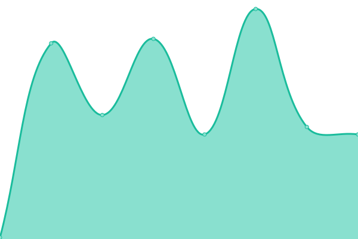
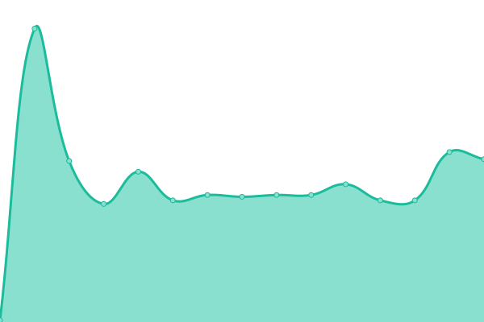
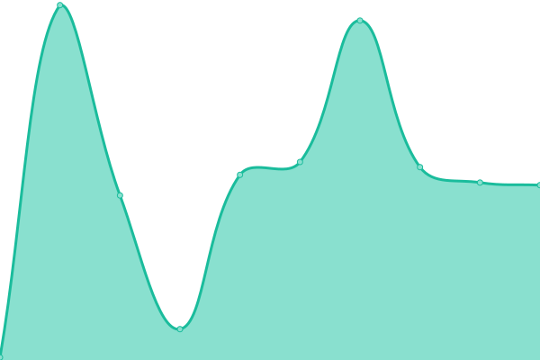
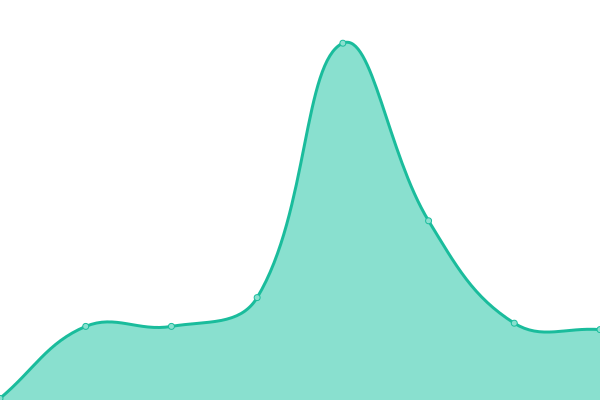

# [📈 Live Status](https://upptime.github.io/upptime): <!--live status--> **🟧 Partial outage**

This repository contains the open-source uptime monitor and status page for [Upptime](https://upptime.js.org), powered by [Upptime](https://github.com/upptime/upptime).

With [Upptime](https://upptime.js.org), you can get your own unlimited and free uptime monitor and status page, powered entirely by a GitHub repository. We use [Issues](https://github.com/upptime/upptime/issues) as incident reports, [Actions](https://github.com/biginvn/upptime/actions) as uptime monitors, and [Pages](https://upptime.github.io/upptime) for the status page.

<!--start: status pages-->
<!-- This summary is generated by Upptime (https://github.com/upptime/upptime) -->
<!-- Do not edit this manually, your changes will be overwritten -->
<!-- prettier-ignore -->
| URL | Status | History | Response Time | Uptime |
| --- | ------ | ------- | ------------- | ------ |
|  [Agoyu](https://agoyu.com/) | 🟩 Up | [agoyu.yml](https://github.com/biginvn/upptime/commits/HEAD/history/agoyu.yml) | 

 510ms
     
 | 

<a href="https://biginvn.github.io/upptime/history/agoyu">100.00%</a>
    

|  [GO Portal](https://goportal.agoyu.com/backend/dashboard#/) | 🟥 Down | [go-portal.yml](https://github.com/biginvn/upptime/commits/HEAD/history/go-portal.yml) | 

 830ms
     
 | 

<a href="https://biginvn.github.io/upptime/history/go-portal">100.00%</a>
    

|  [International booking](https://agoyu.com/api/booking/estimation) | 🟩 Up | [international-booking.yml](https://github.com/biginvn/upptime/commits/HEAD/history/international-booking.yml) | 

 83ms
     
 | 

<a href="https://biginvn.github.io/upptime/history/international-booking">100.00%</a>
    

|  [Fake API testing](https://agoyu.com/api/fake-api/post) | 🟩 Up | [fake-api-testing.yml](https://github.com/biginvn/upptime/commits/HEAD/history/fake-api-testing.yml) | 

 62ms
     
 | 

<a href="https://biginvn.github.io/upptime/history/fake-api-testing">100.00%</a>
    

|  [International booking - Quotation](https://agoyu.com/api/booking/market-place/123) | 🟩 Up | [international-booking-quotation.yml](https://github.com/biginvn/upptime/commits/HEAD/history/international-booking-quotation.yml) | 

 80ms
     
 | 

<a href="https://biginvn.github.io/upptime/history/international-booking-quotation">100.00%</a>
    

|  [Domestic booking](https://agoyu.com/api/booking/estimation) | 🟩 Up | [domestic-booking.yml](https://github.com/biginvn/upptime/commits/HEAD/history/domestic-booking.yml) | 

 92ms
     
 | 

<a href="https://biginvn.github.io/upptime/history/domestic-booking">100.00%</a>
    

|  [Domestic booking - Quotation](https://agoyu.com/api/booking/market-place/123) | 🟩 Up | [domestic-booking-quotation.yml](https://github.com/biginvn/upptime/commits/HEAD/history/domestic-booking-quotation.yml) | 

 78ms
     
 | 

<a href="https://biginvn.github.io/upptime/history/domestic-booking-quotation">100.00%</a>
    

|  [Change Status Booking](https://agoyu.com/api/consumer/moving-plan/cancel/12) | 🟩 Up | [change-status-booking.yml](https://github.com/biginvn/upptime/commits/HEAD/history/change-status-booking.yml) | 

 79ms
     
 | 

<a href="https://biginvn.github.io/upptime/history/change-status-booking">100.00%</a>
    

|  [Register new account](https://agoyu.com/api/consumer/auth/register) | 🟩 Up | [register-new-account.yml](https://github.com/biginvn/upptime/commits/HEAD/history/register-new-account.yml) | 

 84ms
     
 | 

<a href="https://biginvn.github.io/upptime/history/register-new-account">100.00%</a>
    

|  [Consumer Send message](https://agoyu.com/api/notification/chat/new-message) | 🟩 Up | [consumer-send-message.yml](https://github.com/biginvn/upptime/commits/HEAD/history/consumer-send-message.yml) | 

 78ms
     
 | 

<a href="https://biginvn.github.io/upptime/history/consumer-send-message">100.00%</a>
    

|  [Manage Account - Agoyu User](https://agoyu.com/ajax/agoyu/agoyu-user/get-agoyu-user) | 🟩 Up | [manage-account-agoyu-user.yml](https://github.com/biginvn/upptime/commits/HEAD/history/manage-account-agoyu-user.yml) | 

 81ms
     
 | 

<a href="https://biginvn.github.io/upptime/history/manage-account-agoyu-user">100.00%</a>
    

|  [Manage Account - Consumer](https://agoyu.com/ajax/agoyu/consumer/consumers) | 🟩 Up | [manage-account-consumer.yml](https://github.com/biginvn/upptime/commits/HEAD/history/manage-account-consumer.yml) | 

 76ms
     
 | 

<a href="https://biginvn.github.io/upptime/history/manage-account-consumer">100.00%</a>
    

|  [Manage Account - Mover](https://agoyu.com/ajax/agoyu/mover/agoyu-get-movers) | 🟩 Up | [manage-account-mover.yml](https://github.com/biginvn/upptime/commits/HEAD/history/manage-account-mover.yml) | 

 92ms
     
 | 

<a href="https://biginvn.github.io/upptime/history/manage-account-mover">100.00%</a>
    

|  [International Moving Rate](https://agoyu.com/ajax/agoyu/mover/international-rates/manage-rates/custom-rate/list) | 🟩 Up | [international-moving-rate.yml](https://github.com/biginvn/upptime/commits/HEAD/history/international-moving-rate.yml) | 

 78ms
     
 | 

<a href="https://biginvn.github.io/upptime/history/international-moving-rate">100.00%</a>
    

|  [Domestic Moving Rate](https://agoyu.com/ajax/agoyu/mover/domestic-rates/vehicle-rates/list) | 🟩 Up | [domestic-moving-rate.yml](https://github.com/biginvn/upptime/commits/HEAD/history/domestic-moving-rate.yml) | 

 80ms
     
 | 

<a href="https://biginvn.github.io/upptime/history/domestic-moving-rate">100.00%</a>
    

|  [Manage weight Mapping](https://agoyu.com/ajax/agoyu/manage-weight-mapping/search) | 🟩 Up | [manage-weight-mapping.yml](https://github.com/biginvn/upptime/commits/HEAD/history/manage-weight-mapping.yml) | 

 114ms
     
 | 

<a href="https://biginvn.github.io/upptime/history/manage-weight-mapping">100.00%</a>
    

|  [Market Place](https://agoyu.com/api/consumer/quotations) | 🟩 Up | [market-place.yml](https://github.com/biginvn/upptime/commits/HEAD/history/market-place.yml) | 

 79ms
     
 | 

<a href="https://biginvn.github.io/upptime/history/market-place">100.00%</a>
    

|  [Manage Page](https://agoyu.com/ajax/pages/template-content/homepage?pageSlug=homepage) | 🟩 Up | [manage-page.yml](https://github.com/biginvn/upptime/commits/HEAD/history/manage-page.yml) | 

 86ms
     
 | 

<a href="https://biginvn.github.io/upptime/history/manage-page">100.00%</a>
    

|  [Market Place](https://agoyu.com/api/mover/quotations) | 🟩 Up | [market-place.yml](https://github.com/biginvn/upptime/commits/HEAD/history/market-place.yml) | 

 79ms
     
 | 

<a href="https://biginvn.github.io/upptime/history/market-place">100.00%</a>
    

|  [Ping-back Moving Rate](https://agoyu.com/api/mover/pingback/406) | 🟩 Up | [ping-back-moving-rate.yml](https://github.com/biginvn/upptime/commits/HEAD/history/ping-back-moving-rate.yml) | 

 82ms
     
 | 

<a href="https://biginvn.github.io/upptime/history/ping-back-moving-rate">100.00%</a>
    

|  [Open API](https://agoyu.com/api/mover/webhook?page=1&limit=10) | 🟩 Up | [open-api.yml](https://github.com/biginvn/upptime/commits/HEAD/history/open-api.yml) | 

 78ms
     
 | 

<a href="https://biginvn.github.io/upptime/history/open-api">100.00%</a>
    

|  [International Moving Rate](https://agoyu.com/ajax/agoyu/mover/international-rates/manage-rates/custom-rate/list) | 🟩 Up | [international-moving-rate.yml](https://github.com/biginvn/upptime/commits/HEAD/history/international-moving-rate.yml) | 

 78ms
     
 | 

<a href="https://biginvn.github.io/upptime/history/international-moving-rate">100.00%</a>
    

|  [Domestic Moving Rate](https://agoyu.com/ajax/agoyu/mover/domestic-rates/vehicle-rates/list) | 🟩 Up | [domestic-moving-rate.yml](https://github.com/biginvn/upptime/commits/HEAD/history/domestic-moving-rate.yml) | 

 80ms
     
 | 

<a href="https://biginvn.github.io/upptime/history/domestic-moving-rate">100.00%</a>
    

|  [Manage User](https://agoyu.com/ajax/mover/movers) | 🟩 Up | [manage-user.yml](https://github.com/biginvn/upptime/commits/HEAD/history/manage-user.yml) | 

 78ms
     
 | 

<a href="https://biginvn.github.io/upptime/history/manage-user">100.00%</a>
    

|  [Manage Booking Request](https://agoyu.com/api/mover/booking) | 🟩 Up | [manage-booking-request.yml](https://github.com/biginvn/upptime/commits/HEAD/history/manage-booking-request.yml) | 

 76ms
     
 | 

<a href="https://biginvn.github.io/upptime/history/manage-booking-request">100.00%</a>
    

|  [Register new account](https://agoyu.com/api/mover/auth/register) | 🟩 Up | [register-new-account.yml](https://github.com/biginvn/upptime/commits/HEAD/history/register-new-account.yml) | 

 84ms
     
 | 

<a href="https://biginvn.github.io/upptime/history/register-new-account">100.00%</a>
    

|  [Mover Send message](https://agoyu.com/api/mover/chat/send-notification) | 🟩 Up | [mover-send-message.yml](https://github.com/biginvn/upptime/commits/HEAD/history/mover-send-message.yml) | 

 75ms
     
 | 

<a href="https://biginvn.github.io/upptime/history/mover-send-message">100.00%</a>
    

|  [Logout](https://agoyu.com/api/custom-user/auth/logout) | 🟩 Up | [logout.yml](https://github.com/biginvn/upptime/commits/HEAD/history/logout.yml) | 

 80ms
     
 | 

<a href="https://biginvn.github.io/upptime/history/logout">100.00%</a>
    

|  [Login](https://agoyu.com/api/custom-user/auth/login) | 🟩 Up | [login.yml](https://github.com/biginvn/upptime/commits/HEAD/history/login.yml) | 

 80ms
     
 | 

<a href="https://biginvn.github.io/upptime/history/login">100.00%</a>
    

|  [Google API](https://agoyu.com/api/google/detail-place?address=123) | 🟩 Up | [google-api.yml](https://github.com/biginvn/upptime/commits/HEAD/history/google-api.yml) | 

 62ms
     
 | 

<a href="https://biginvn.github.io/upptime/history/google-api">100.00%</a>
    

|  [Upload media](https://agoyu.com/api/media/uploadSingle) | 🟩 Up | [upload-media.yml](https://github.com/biginvn/upptime/commits/HEAD/history/upload-media.yml) | 

 77ms
     
 | 

<a href="https://biginvn.github.io/upptime/history/upload-media">100.00%</a>
    

|  [Consumer list moving plan](https://agoyu.com/api/consumer/moving-plan) | 🟩 Up | [consumer-list-moving-plan.yml](https://github.com/biginvn/upptime/commits/HEAD/history/consumer-list-moving-plan.yml) | 

 76ms
     
 | 

<a href="https://biginvn.github.io/upptime/history/consumer-list-moving-plan">100.00%</a>
    

|  [Consumer detail moving plan](https://agoyu.com/api/consumer/moving-plan/12) | 🟩 Up | [consumer-detail-moving-plan.yml](https://github.com/biginvn/upptime/commits/HEAD/history/consumer-detail-moving-plan.yml) | 

 79ms
     
 | 

<a href="https://biginvn.github.io/upptime/history/consumer-detail-moving-plan">100.00%</a>
    

|  [Consumer detail moving plan audit log](https://agoyu.com/api/consumer/moving-plan/audit-log/12) | 🟩 Up | [consumer-detail-moving-plan-audit-log.yml](https://github.com/biginvn/upptime/commits/HEAD/history/consumer-detail-moving-plan-audit-log.yml) | 

 77ms
     
 | 

<a href="https://biginvn.github.io/upptime/history/consumer-detail-moving-plan-audit-log">100.00%</a>
    

|  [Consumer list notification](https://agoyu.com/api/consumer/notifications?page=1&limit=10) | 🟩 Up | [consumer-list-notification.yml](https://github.com/biginvn/upptime/commits/HEAD/history/consumer-list-notification.yml) | 

 77ms
     
 | 

<a href="https://biginvn.github.io/upptime/history/consumer-list-notification">100.00%</a>
    

|  [Get data SEO page](https://agoyu.com/api/page/homepage) | 🟩 Up | [get-data-seo-page.yml](https://github.com/biginvn/upptime/commits/HEAD/history/get-data-seo-page.yml) | 

 84ms
     
 | 

<a href="https://biginvn.github.io/upptime/history/get-data-seo-page">100.00%</a>
    

|  [Consumer profile](https://agoyu.com/api/consumer/profile) | 🟩 Up | [consumer-profile.yml](https://github.com/biginvn/upptime/commits/HEAD/history/consumer-profile.yml) | 

 81ms
     
 | 

<a href="https://biginvn.github.io/upptime/history/consumer-profile">100.00%</a>
    

|  [Consumer quotation detail](https://agoyu.com/api/consumer/quotations/12) | 🟩 Up | [consumer-quotation-detail.yml](https://github.com/biginvn/upptime/commits/HEAD/history/consumer-quotation-detail.yml) | 

 79ms
     
 | 

<a href="https://biginvn.github.io/upptime/history/consumer-quotation-detail">100.00%</a>
    

|  [Reference booking](https://agoyu.com/api/references) | 🟩 Up | [reference-booking.yml](https://github.com/biginvn/upptime/commits/HEAD/history/reference-booking.yml) | 

 197ms
     
 | 

<a href="https://biginvn.github.io/upptime/history/reference-booking">100.00%</a>
    

|  [List room temp booking](https://agoyu.com/api/consumer/survey/room-temp?booking_id=12) | 🟩 Up | [list-room-temp-booking.yml](https://github.com/biginvn/upptime/commits/HEAD/history/list-room-temp-booking.yml) | 

 85ms
     
 | 

<a href="https://biginvn.github.io/upptime/history/list-room-temp-booking">100.00%</a>
    

<!--end: status pages-->

[**Visit our status website →**](https://upptime.github.io/upptime)

## 📄 License

- Powered by: [Upptime](https://github.com/upptime/upptime)
- Code: [MIT](./LICENSE) © [Upptime](https://upptime.js.org)
- Data in the `./history` directory: [Open Database License](https://opendatacommons.org/licenses/odbl/1-0/)
